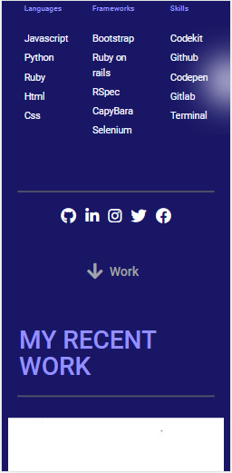

# Hello Microverse

> Module 1, Day 4. Update to MyPortfolio Project

 <!--- Place a screenshot of my project here -->

<!--- This is an HTML comment in Markdown -->

Professional personnal portfolio website which showcase my skills and projects as a Web Software Developer. (Milestone 2)

## Built With

- HTML
- CSS
- Webhint
- Stylelint

## Getting Started

To get a local copy up and running follow these simple example steps.

### Pre-requisites

- Knowledge on basic html and css
- Text Editor (VScode, Atom, Sublime text, etc)
- Basic knowledge of node.js

### Setup

- clone repository using `git clone`
- run `npm install`
- run `live server`

## Authors

👤 **Author**

- GitHub: [@fernando-silvabr66](https://github.com/fernando-silvabr66)
- Twitter: [@fsilvabr1](https://twitter.com/fsilvabr1)
- LinkedIn: [https://linkedin.com/in/fernando-silvabr66](https://linkedin.com/in/fernando-silvabr66)

## Show your support

Give a ⭐️ if you like this project!

## Acknowledgments

- Hat tip to anyone whose code was used
- Inspiration
- etc

## 📝 License

This project is [MIT](./MIT.md) licensed.